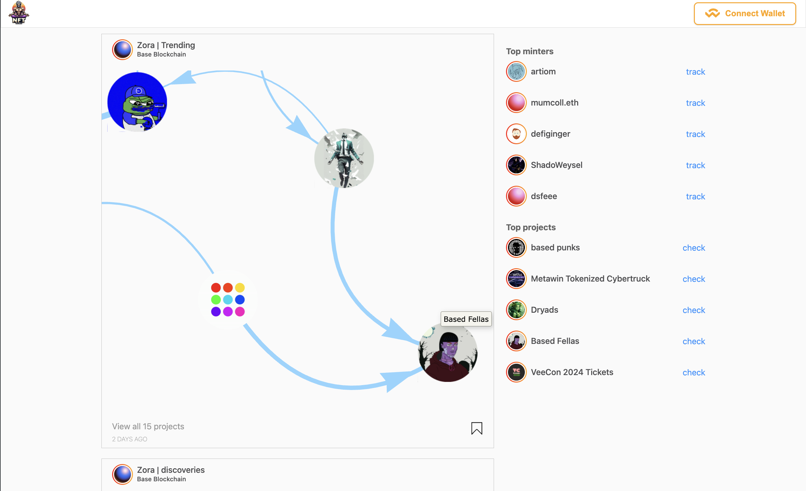
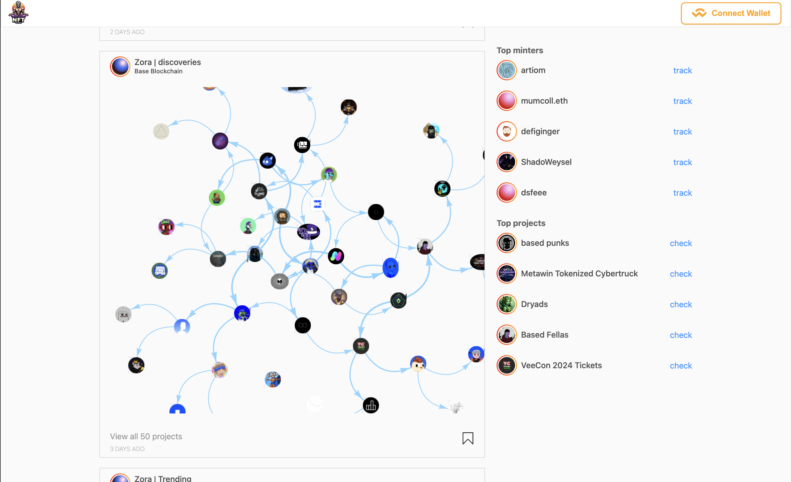
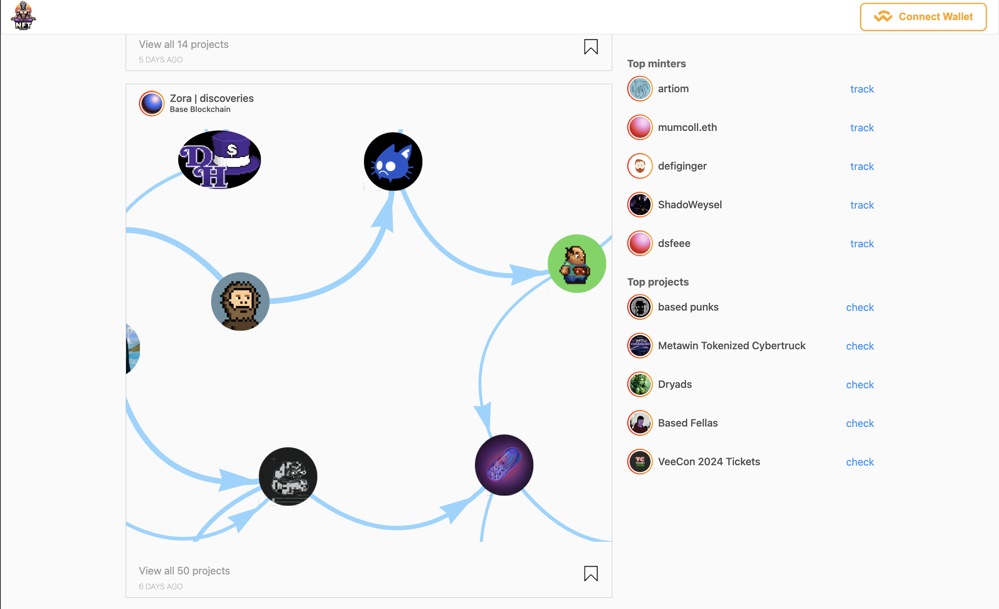

# NFT Guru

## Uncover Zora NFT interactions with network analysis.

Front-end clients witch help creators discover, inspect, and analyze deep internal linkages between various collections.

The NFT market is huge and diverse, but the tools to analyze it are scarce and one-sided.
They are generally tracking simple metrics like TVL, daily trading volume, or floor price. It's hard to predict future price movements or analyze changes based on them alone.

### Solution

The key is that **NFT is a social and community phenomenon**, so we need to tackle it like one. We are using network analysis tools and algorithms, to build a **directional dynamic graph** and analyze its mutations.
It's the same approach used in analyzing Facebook or Twitter followers networks.

### Technical approach

For data collection, we are using Zora API to get on-chain-based metrics about sales, transfer, and mintages together. Then on top, we put the zora.co plus Farcaster friends and followers data to connect minters with their social circles.

By using a bunch of dynamic graph analysis algorithms like **Temporal Closeness Centrality**, **Dynamic Label Propagation**, and **Factorization-based clustering** we can try to predict the causation between events and outcomes, for example:

- influential minter buy NFT an influx of new traders which was not present in the collection network
- mass following the farcaster page of the project => transfer of attention and subscribers base to the close project
- several Zora users you follow minting the same NFT => you mint this NFT and **transfer the impulse further**

### Product

The tool is built in a form similar to the Zora trending feed, with each post showing an interactive network of various collections and minters connected together.

By analyzing these linkages a curious user can potentially find a project to invest in and enjoy not long after they start hyping.

Also, you could check the health factor of the collection, calculated by a change in the value of the "liquidity network effect" that it generates in the community. This could help prevent the investment in the project which start declining.

### Usage guide

#### Data part

You can find the data-gathering and part of the analysis algorithm in the corresponding folders.

To just enjoy the result just start a web app.

###$ Web app part

```
npm i
```

```
npm run start
```

#### Notice

Also, the raw data and most of the algorithms used are closed-sourced. I will make a platform out of it later and open it to the community.

#### Some nice pictures to showcase the results





### Challenges I ran into

- I can't find a way to access zora.co followers and following list throw API, so I used the ineffective approach of writing a selenium-based web scrapper to parse them manually. This is slow and inefficient and limits the amount of data we can get.

- As we are building a dynamic network, we need a "snapshot" of the network at each point in time. However, the granularity for the two networks is different. For blockchain, it is up to every block, but for the social component it's limited by the time between the parser passes through all the web pages, which is usually days. This makes prediction less accurate.

- To parse all Farcaster followers for every project and their 1-level deep friend circle you need a lot of time, so the multithreading was needed.

- The amount of data-mining, cleaning and analysis to be done for the result of several graph is big and the process is extremly haotic, so I was not able to automate it yet. But the automation is needed to make a platform out of it.
